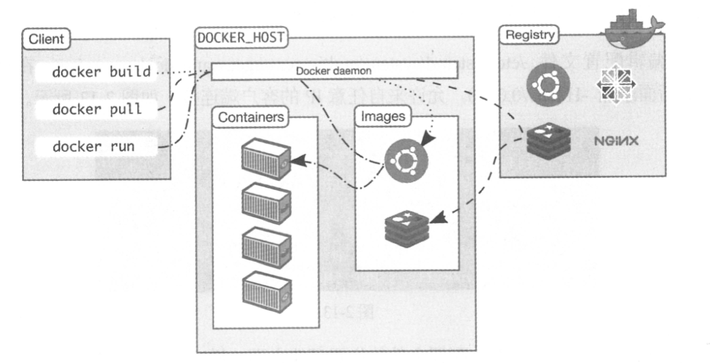

## what-啥是容器呢？

> 按照我的理解  容器就是像集装箱一样	

### How-容器是如何工作的?

> 看一下docker架构 ,Docker核心组件包括:

> - Docker客户端：Client
> - Docker服务器：Docker daemon
> - Docker镜像：Image
> - Registry
> - Docker容器：Container

> 注意：HOST:宿主机的意思

> ### Docker客户端：
>
> 也就是像dos一样的命令界面, 通过docker命令可以在宿主机上构建和运行容器，除了docker命令行工具，还可以通过REST API与服务器通信；

> ### Docker服务器：
>
> Docker daemon是服务器组件，以linux后台服务的方式运行, Docker daemon运行在Docker host上，负责创建，运行，监控容器，构建，存储镜像。
>
> Docker daemon 只能响应本地的Host的客户端请求，远程的客户端请求，需要在配置文件中打开TCP监听，步骤如下：
>
> 1. 编辑配置文件: /etc/systemd/system./multi-user.target.wants/docker.service  在环境变量ExecStart 后面添加 -H tcp:/0.0.0.0 允许任意ip的客户端连接，其他系统的配置文件的位置可能不同，要注意哦！！
>
> 2. 重启Docker daemon  
>
>    systemctl daemon-reload   systemctl restart docker.service
>
> 3. 服务器IP为:  120.77.36.24 客户端在命令行里加上-H 参数，即可与远程服务器通信。
>
>    docker -H 192.168.56.102 info

> ### Docker 镜像
>
> 可将Docker镜像看成只读模板，通过它可以创建Docker容器
>
> 可以将镜像的内容和创建步骤描述在一个文本文件中-dockerfile，通过执行docker build <docker-file> 命令可以构建docker容器

> ### Docker容器 
>
> Docker容器就是Docker镜像的运行实例  
>
> 可以通过CLI或是API启动 停止 移动 删除容器 可以理解为 对于应用软件 镜像就是处于生命周期的构建和打包阶段，容器就是启动和运行阶段

>### Registry
>
>Registry 就是存放镜像的仓库 Registry分为私有和公有
>
>Docker Hub 是公有的仓库 我们自己可以创建自己的私有仓库 
>
>docker pull 命令可以从Registry下载镜像
>
>docker run 命令是下载 然后再启动容器

> 额外：	